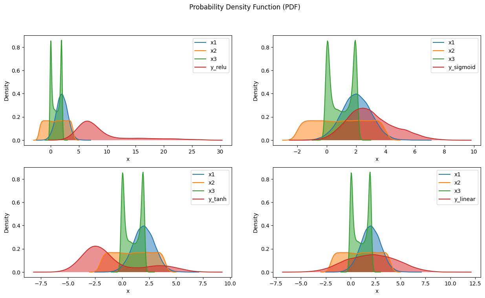
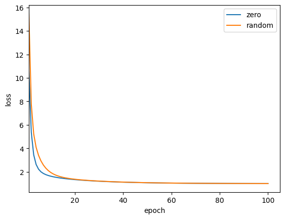
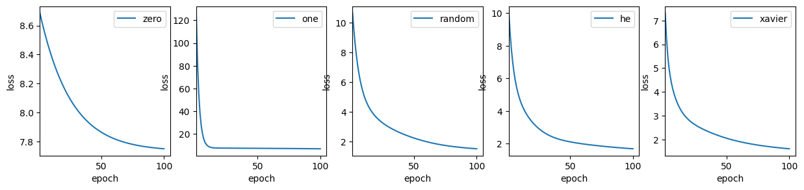

# 深入分析神经网络的权重初始化方法


```python
import numpy as np
import matplotlib.pyplot as plt
import torch
import torch.optim as optim  
from scipy.stats import gaussian_kde  
from torch import nn
import torch.nn.init as init  
```

神经网络的权重初始化是一个重要的步骤，它可以显著影响模型的学习效率和最终性能。权重初始化的主要目标是使每一层的输入信号和激活输出信号大致均衡，避免出现梯度消失或梯度爆炸的问题。下面介绍几种常用的权重初始化方法：

1. **零初始化（Zero Initialization）**
- 所有权重初始化为零。这种方法虽然简单，但不推荐，因为它会导致所有神经元学习到相同的特征，从而使每个神经元都在更新相同的权重。

2. **随机初始化（Random Initialization）**
- 权重被初始化为小的随机值，通常遵循均匀分布或正态分布。虽然这比零初始化更好，但仍然可能导致梯度消失或爆炸的问题。

3. **Xavier 初始化（Glorot Initialization）**
- 适用于激活函数如 sigmoid 或 tanh。权重被初始化为均值为零，方差为 $ \frac{2}{n_{\text{in}} + n_{\text{out}}} $ 的正态分布，其中 $ n_{\text{in}} $ 是输入神经元的数量，$ n_{\text{out}} $ 是输出神经元的数量。

4. **He 初始化（He Initialization）**
- 针对使用 ReLU (Rectified Linear Unit) 激活函数的网络。权重被初始化为均值为零，方差为 $ \frac{2}{n_{\text{in}}} $ 的正态分布。这种方法在深度学习中广泛应用，因为 ReLU 函数在输入为负时输出为零，这使得它面临梯度消失的问题。

## tools function


```python
def plot_pdf(x, ax=None, label='PDF'):  
    """  
    绘制给定数据点的概率密度函数 (PDF)  

    参数:  
    x : array-like  
        输入的 x 值数组  
    ax : matplotlib.axes.Axes, optional  
        绘图的目标轴，如果为 None 则使用当前图形  
    """  
    if ax is None:  
        fig, ax = plt.subplots()  
    
    density = gaussian_kde(x)  
    x_vals = np.linspace(np.min(x) - 1, np.max(x) + 1, 100)  
    y_vals = density(x_vals)  
    
    ax.plot(x_vals, y_vals, label=label)  
    ax.fill_between(x_vals, y_vals, alpha=0.5)  
    ax.set_xlabel('x')  
    ax.set_ylabel('Density')  


def train_model(model, X_tensor, y_tensor, criterion, optimizer, num_epochs=100):  
    """  
    训练模型的函数  

    参数:  
    model : nn.Module  
        要训练的模型  
    X_tensor : torch.Tensor  
        输入特征的张量  
    y_tensor : torch.Tensor  
        输出标签的张量  
    criterion : nn.Module  
        损失函数  
    optimizer : torch.optim.Optimizer  
        优化器  
    num_epochs : int  
        训练的轮数  
        
    返回:  
    list  
        每100个epoch的损失值列表  
    """  
    losses = []  
    
    for epoch in range(num_epochs):  
        model.train()  
        
        # 前向传播  
        output = model(X_tensor)  
        loss = criterion(output, y_tensor)  
        
        # 反向传播和优化  
        optimizer.zero_grad()  
        loss.backward()  
        optimizer.step()  
        
        losses.append(loss.item())  
    
    return losses  

def plot_pred(X, y, model):  
    """  
    绘制训练结果的函数  

    参数:  
    X : array-like  
        原始输入特征  
    y : array-like  
        原始输出标签  
    model : nn.Module  
        训练后的模型  
    """  
    model.eval()  # 设置模型为评估模式  
    X_tensor = torch.FloatTensor(X)  # 转换输入特征为张量  
    predicted = model(X_tensor).detach().numpy()  # 获取预测值  

    plt.scatter(X, y, label='Original data')  # 绘制原始数据散点图  
    plt.plot(X, predicted, color='red', label='Fitted line')  # 绘制拟合直线  
    plt.xlabel('X')  
    plt.ylabel('y')  
    plt.title('Linear Regression using PyTorch')  
    plt.legend()  
    plt.show()  

def plot_loss(loss, ax = None, label=''):
    if ax is None:
        ax = plt.axes()
    ax.plot(range(1, len(loss) + 1), loss, label=label)
    ax.set_xlim(1)
    # ax.set_title(title)
    ax.set_xlabel('epoch')
    ax.set_ylabel('loss')
```

## 实验模型


```python
# 线性模型
def linear(): 
    return nn.Linear(3, 1)

# MLP模型
def mlp(activation_layer):
    mlp = nn.Sequential(
        nn.Linear(3, 10),
        activation_layer,
        nn.Linear(10, 1)
    )
    return mlp
```

## 训练数据


```python
torch.manual_seed(42)
```

#### 模拟输入

我们将输入特征构造成多个不同的分布, 不采用标准的特殊分布, 从而更好地将分析结果泛化到一般情况


```python
def make_X(n):
    """模拟生成输入数据"""
    X = np.zeros(shape=(n, 3))
    X[:,0] = np.random.randn(n) + 2
    X[:,1] = np.random.uniform(-2, 4, n)
    X[:,2] = np.sin(np.random.uniform(-1, 1, n) * 2) + 1

    return torch.Tensor(X)

X = make_X(10000)
X.shape, X.dtype
```


    (torch.Size([10000, 3]), torch.float32)


### 模拟输出

##### 参数设定


```python
# 线性模型
w_true = torch.Tensor([[1.2, -0.5, 2.2]])
b_true = torch.FloatTensor([-2.0])


# MLP隐藏层
wh_true = torch.randn(30).reshape(10, 3) * 2
bh_true = torch.Tensor([-1.0, 0.5, 0.1, 0.4, 2.5, -1.0, 0.5, 0.1, 0.4, 2.5])
wo_true = torch.randn(10).reshape(1, 10)
bo_true = torch.Tensor([1.0])
```

##### 模拟计算

###### 线性模型


```python
linear_net = linear()
linear_net.weight.data = w_true
linear_net.bias.data = b_true
linear_net.weight.data, linear_net.bias.data
```


    (tensor([[ 1.2000, -0.5000,  2.2000]]), tensor([-2.]))


```python
y_l = linear_net(X).detach() + torch.randn(X.shape[0]).reshape(-1, 1)
```

###### MLP


```python
nets = dict(relu=mlp(nn.ReLU()), sigmoid=mlp(nn.Sigmoid()), tanh=mlp(nn.Tanh()))
for net in nets.values():
    net: nn.Module
    net[0].weight.data = wh_true
    net[0].bias.data = bh_true
    net[2].weight.data = wo_true
    net[2].bias.data = bo_true
ys = {k: net(X).detach() + torch.randn((X.shape[0])).reshape(-1, 1) for k, net in nets.items()}
```

###### 汇总


```python
nets['linear'] = linear_net # type: ignore
ys['linear'] = y_l
```

### 可视化输入输出 分布


```python
fig, axes = plt.subplots(nrows=2, ncols=2, figsize=(15, 8))
fig.suptitle('Probability Density Function (PDF)')  
axes = axes.flatten()
X_np = X.numpy()
for ax, (model_name, y) in zip(axes, ys.items()):
    plot_pdf(X_np[:, 0], ax=ax, label='x1')
    plot_pdf(X_np[:, 1], ax=ax, label='x2')
    plot_pdf(X_np[:, 2], ax=ax, label='x3')
    plot_pdf(y.numpy().reshape(-1), ax=ax, label='y_' + model_name)
    ax.legend()

plt.show()
```



    


## 初始化方法


```python
# 零初始化
def zero_init(m):
    if isinstance(m, nn.Linear):   
        init.zeros_(m.weight)  
        init.zeros_(m.bias) 

# one初始化
def one_init(m):
    if isinstance(m, nn.Linear):   
        init.constant_(m.weight, 1)  
        init.zeros_(m.bias)

# 随机初始化
def random_init(m):
    if isinstance(m, nn.Linear):   
        init.normal_(m.weight, 0.01)  
        init.zeros_(m.bias)

# He初始化
def he_init(m):
    if isinstance(m, nn.Linear):
        init.kaiming_normal_(m.weight)
        init.zeros_(m.bias)

# xavier初始化
def xavier_init(m):
    if isinstance(m, nn.Linear):
        init.xavier_normal_(m.weight)
        init.zeros_(m.bias)

init_func_dict = dict(
    zero=zero_init,
    one=one_init,
    random=random_init,
    he=he_init,
    xavier=xavier_init
)
```

## 权重零初始化的特性分析


```python
criterion = nn.MSELoss()  # 均方误差损失  
```

### 线性回归


```python
loss_dict = {}

selected_dict  = dict(filter(lambda item: item[0] in ('zero', 'random'), init_func_dict.items()))
for k, init_func in selected_dict.items():
    net = linear()
    net.apply(init_func)
    # display(net.weight.data)
    optimizer = optim.SGD(net.parameters(), lr=0.1)  # 随机梯度下降  
    loss = train_model(net, X, y, criterion=criterion, optimizer=optimizer, num_epochs=100)
    loss_dict[k] = loss
```


```python
loss_dict.keys()
```


    dict_keys(['zero', 'random'])


```python
ax = plt.axes()
for k, loss in loss_dict.items():
    print(k)
    plot_loss(loss, ax=ax, label=k)
plt.legend()
plt.show()
```

    zero
    random



    


> 正常进行梯度下降, 零初始化对于线性模型不存在对称性

### MLP


```python
loss_dict = {}
train_nets = {}
selected_dict  = dict(filter(lambda item: item[0] in ('zero', 'one', 'random', 'he', 'xavier'), init_func_dict.items()))
for k, init_func in selected_dict.items():
    net = mlp(nn.Tanh())
    net.apply(init_func)
    # display(net[2].weight.data)
    optimizer = optim.SGD(net.parameters(), lr=0.01)  # 随机梯度下降  
    loss = train_model(net, X, ys['tanh'], criterion=criterion, optimizer=optimizer, num_epochs=100)
    loss_dict[k] = loss
    train_nets[k] = net
```


```python
fig, axes = plt.subplots(ncols=len(selected_dict), nrows=1, figsize=(15, 3))
for ax, (k, loss) in zip(axes.flatten(), loss_dict.items()):
    plot_loss(loss, ax=ax, label=k)
    ax.legend()
    print(f"{k} init: {loss[-1]:.2f}")
plt.show()
```

    zero init: 7.75
    one init: 6.91
    random init: 1.53
    he init: 1.69
    xavier init: 1.61



    


```python
train_nets['zero'][2].weight.data, train_nets['zero'][0].weight.data
```


    (tensor([[0., 0., 0., 0., 0., 0., 0., 0., 0., 0.]]),
     tensor([[0., 0., 0.],
             [0., 0., 0.],
             [0., 0., 0.],
             [0., 0., 0.],
             [0., 0., 0.],
             [0., 0., 0.],
             [0., 0., 0.],
             [0., 0., 0.],
             [0., 0., 0.],
             [0., 0., 0.]]))


```python
train_nets['zero'][2].bias.data
```


    tensor([-0.8474])


> 权重初始化为0, 对称性导致权重的梯度更新始终为0


```python
train_nets['one'][2].weight.data, train_nets['one'][0].weight.data
```


    (tensor([[-0.1123, -0.1123, -0.1123, -0.1123, -0.1123, -0.1123, -0.1123, -0.1123,
              -0.1123, -0.1123]]),
     tensor([[0.9429, 1.0374, 0.9788],
             [0.9429, 1.0374, 0.9788],
             [0.9429, 1.0374, 0.9788],
             [0.9429, 1.0374, 0.9788],
             [0.9429, 1.0374, 0.9788],
             [0.9429, 1.0374, 0.9788],
             [0.9429, 1.0374, 0.9788],
             [0.9429, 1.0374, 0.9788],
             [0.9429, 1.0374, 0.9788],
             [0.9429, 1.0374, 0.9788]]))


> 尝试使用 非零常数初始化, 看到模型可以发生一些更新了, 但隐藏层退化成了单节点 

### 小结

* 常数权重初始化对于简单的线性网络可以正常进行梯度下降, 但对于多层的非线性神经网络, 对称特性会使得模型退化为线性(隐藏层每层坍缩为一个节点)。 尤其对于将权重全部初始化为0的情况, 模型彻底退化成一个只有输出节点偏执项的方程(y = b)
* 从对称特性也可以看出：初始化后, 模型每个节点的权重连接是初始化参数去重后的数量
* 通常不建议将参数初始化为常数

## He (kaiming) 初始化的特性分析

Kaiming 初始化（也称为 He 初始化）是针对深度神经网络的权重初始化方法，特别是用于使用 ReLU（Rectified Linear Unit）激活函数的网络。这个方法由 Kaiming He 等人在 2015 年提出，旨在帮助深层网络加速收敛并改善训练效果。在深度学习中，权重初始化对模型的训练速度和性能有显著影响。采用不当的权重初始化方法可能导致梯度消失（vanishing gradients）或爆炸（exploding gradients），从而阻碍模型的训练。Kaiming 初始化针对这些问题，提出了一种新的权重初始化方案。Kaiming 初始化的核心思想是考虑每一层的输入和输出的方差，以确保信号在前向传播过程中保持均衡。具体来说，它通过以下公式来初始化权重：

- 对于使用 ReLU 激活函数的层，权重初始化如下：

$$
w \sim \mathcal{N}(0, \frac{2}{n_{in}})
$$

其中，$ n_{in} $ 是当前层的输入神经元数，$\mathcal{N}(0, \sigma^2)$ 表示均值为 0、方差为 $\sigma^2$ 的正态分布。

- 对于使用带有泄漏的 ReLU 或其他非线性激活函数的层，Kaiming 初始化也能有效地应用。对于这些层，Kaiming 初始化可以稍作调整。


### 完整数学证明

何凯明在论文Delving Deep into Rectifiers中的证明过程:

1. **方差的定义与推导**：
   - 在每一层，神经网络的输出 $y_l$ 可以表示为：
     $$
     y_l = W_l x_l + b_l
     $$
     其中，$W_l$ 是当前层的权重，$x_l$ 是输入，$b_l$ 是偏置。为了分析方差，作者假设权重 $W_l$ 的初始化元素是相互独立的，并且共享相同的分布。

2. **方差计算**：
   - 根据独立变量的方差乘法法则，输出的方差可以表示为：
     $$
     \text{Var}[y_l] = n_l \text{Var}[w_l] \mathbb{E}[x_l^2]
     $$
     其中，$n_l$ 是当前层的连接数，$\text{Var}[w_l]$ 是权重的方差，$\mathbb{E}[x_l^2]$ 是输入信号的平方期望。

3. **ReLU激活函数的影响**：
   - 对于ReLU激活函数，输出 $x_l$的计算为 $x_l = \max(0, y_{l-1})$，这意味着 $x_l$ 不再是零均值的。通过推导，作者得出：
     $$
     \mathbb{E}[x_l^2] = \frac{1}{2} \text{Var}[y_{l-1}]
     $$
   - 将此结果代入方差计算中，得到：
     $$
     \text{Var}[y_l] = \frac{1}{2} n_l \text{Var}[w_l] \text{Var}[y_{l-1}]
     $$

4. **层间方差传递**：
   - 通过将所有层的方差关系结合，得到：
     $$
     \text{Var}[y_L] = \text{Var}[y_1] \left( \prod_{l=2}^{L} \frac{1}{2} n_l \text{Var}[w_l] \right)
     $$
   - 为了避免信号在层间传递时的方差过度缩小或放大，作者提出了一个条件：
     $$
     \frac{1}{2} n_l \text{Var}[w_l] = 1, \forall l
     $$
   - 这个条件确保了每一层的输出方差保持在一个合理的范围内，从而促进了网络的收敛。

5. **初始化权重**：
   - 根据上述推导，作者建议使用零均值的高斯分布进行权重初始化，其标准差为：
     $$
     \sigma = \sqrt{\frac{2}{n_l}}
     $$


### 假设条件分析

我们通过对假设条件进行预演, 通过验证 $E[y^2] = \frac{1}{2}var[z]$ 和 $E[wx] = E[w]E[x] = 0$, 来具体分析在一般情况下kaiming初始化有效的适用条件。


```python
def relu(z):
    return np.maximum(z, 0)
```

#### 输入是任意分布, 节点的连接数量比较少时


```python
n = 10000   # 随机样本数量
X = make_X(n).numpy()
w = np.random.normal(size=X.shape[-1])    # 随机初始化权重
xi = np.arange(n)
z = w * X
y = relu(z)
print(f"比例: {(y ** 2).mean() / z.var():.2f}")
print(f"E[wx] = {X.mean() * w.mean()}")
```

    比例: 0.99
    E[wx] = 0.1596622498393754


> 可以看到这里很随机, 原因是我们的权重个数太少了, 无法满足正态分布特征

#### 输入是任意分布, 连接的节点数量比较多时


```python
n = 10000   # 随机样本数量
X = make_X(n).numpy()
X = np.concatenate([X] * 150, axis=1)
print(X.shape)
w = np.random.normal(size=X.shape[-1])    # 随机初始化权重
xi = np.arange(n)
z = w * X
y = relu(z)
print(f"比例: {(y ** 2).mean() / z.var():.2f}")
print(f"E[wx] = {X.mean() * w.mean()}")
```

    (10000, 450)
    比例: 0.42
    E[wx] = -0.07124622657463205


> 我们把连接的数量增加到了450个, 可以看到此时理论上的结论是成立的了

通常来说, 简单的浅层神经网络每层的节点数是不会过于庞大的, 所以 kaiming 初始化的方差收敛特性可能不会很明显。但是当节点数比较大时, kaiming初始化会有非常好的收敛特性。 从这里可以看出, 在假设条件上, 凡是保证E[wx]接近0, 从推导过程来看, kaiming 都是可以具备比较好的收敛特性的。也就是说, 如果输入的特征分布满足期望为0, 也能确保模型各层参数方差的收敛性

#### 输入的特征分布满足均值为0, 连接节点较少时


```python
n = 10000   # 随机样本数量
X = make_X(n).numpy()
X = X - X.mean(axis=0)
print(X.shape)
w = np.random.normal(size=X.shape[-1])    # 随机初始化权重
xi = np.arange(n)
z = w * X
y = relu(z)
print(f"比例: {(y ** 2).mean() / z.var():.2f}")
print(f"E[wx] = {X.mean() * w.mean()}")
```

    (10000, 3)
    比例: 0.50
    E[wx] = -1.382262191096186e-06


> 显然是满足的

#### 结论

通过对假设条件进行验证分析, 可以得出一下结论:
* 在不考虑输入特征分布的情况下, kaiming初始化对输入节点数比较多的层成立, 而对于输入节点较少的层往往存在较大的偏差
* 在不考虑输入节点数量的情况下, kaiming初始化在输入特征期望为0的条件下是成立的, 所以也从侧面说明了, 常见的特征归一化方法Z-score可以有效帮助模型保持方差稳定, 从而加速训练, 而 min-max归一化在这一方面没有很好的支持 

### Xavier 初始化的特性分析

它的假设条件及推导过程和kaiming初始化基本上是差不多的, 我们把kaiming初始化中使用的ReLU改为Tanh即可得出结论。因为一般性的, 归一化的输入在经过激活函数时, 分布区域上的tanh接近斜率为1的线性曲线, 也就是说在经过激活函数后不会发生减半。 因此也就得到了Xavier初始化的具体形式:
$$
w \sim \mathcal{N}(0, \frac{1}{n_{in}})
$$

### 假设条件分析

我们通过对假设条件进行预演, 通过验证 $E[y^2] = var[z]$ 和 $E[wx] = E[w]E[x] = 0$, 来具体分析在一般情况下kaiming初始化有效的适用条件。


```python
def tanh(z):
    return (1 - np.exp(-2*z)) / (1 + np.exp(-2*z))
def sigmoid(z):
    return 1 / (1 + np.exp(-z))
```

#### 输入特征只保持均值为0, 不做标准归一化


```python
n = 10000   # 随机样本数量
X = make_X(n).numpy()
X = X - X.mean(axis=0)
print(X.shape)
w = np.random.normal(size=X.shape[-1])    # 随机初始化权重
xi = np.arange(n)
z = w * X
y = tanh(z)
print(f"比例: {(y ** 2).mean() / z.var():.2f}")
print(f"E[wx] = {X.mean() * w.mean()}")
```

    (10000, 3)
    比例: 0.36
    E[wx] = 1.298750733845933e-07


> 可以看出, 未归一化但均值为0的情况下, Xavier初始化收敛存在较大的偏差

#### 输入特征进行标准归一化


```python
n = 10000   # 随机样本数量
X = make_X(n).numpy()
X = ((X - X.mean(axis=0)) / X.var(axis=0))
print(X.shape)
w = np.random.normal(size=X.shape[-1])    # 随机初始化权重
xi = np.arange(n)
z = w * X
y = tanh(z)
print(f"比例: {(y ** 2).mean() / z.var():.2f}")
print(f"E[wx] = {X.mean() * w.mean()}")
```

    (10000, 3)
    比例: 0.55
    E[wx] = -4.623633662144457e-07


> 从结果上来看, 依旧存在较大的偏差, 标准化后输入范围区间上还不能看成是线性的

#### 输入特征进行标准归一化, 并缩放到更小范围之内


```python
n = 10000   # 随机样本数量
X = make_X(n).numpy()
X = ((X - X.mean(axis=0)) / X.var(axis=0)) * 0.2    # 继续缩小5倍
print(X.shape)
w = np.random.normal(size=X.shape[-1])    # 随机初始化权重
xi = np.arange(n)
z = w * X
y = tanh(z)
print(f"比例: {(y ** 2).mean() / z.var():.2f}")
print(f"E[wx] = {X.mean() * w.mean()}")
```

    (10000, 3)
    比例: 0.99
    E[wx] = -2.2648742300121803e-08


> 此时满足条件

#### 输入是任意分布, 连接的节点数量比较多时


```python
n = 10000   # 随机样本数量
X = make_X(n).numpy()
X = np.concatenate([X] * 1000, axis=1)
print(X.shape)
w = np.random.normal(size=X.shape[-1])    # 随机初始化权重
xi = np.arange(n)
z = w * X
y = tanh(z)
print(f"比例: {y.var() / z.var():.2f}")
print(f"E[wx] = {X.mean() * w.mean()}")
```

    (10000, 3000)
    比例: 0.13
    E[wx] = 0.038571111032556143


```python
n = 10000   # 随机样本数量
X = make_X(n).numpy()
X = np.concatenate([X] * 1000, axis=1)
print(X.shape)
w = np.random.normal(size=X.shape[-1]) * 0.05    # 随机初始化权重
xi = np.arange(n)
z = w * X
y = tanh(z)
print(f"比例: {y.var() / z.var():.2f}")
print(f"E[wx] = {X.mean() * w.mean()}")
```

    (10000, 3000)
    比例: 0.96
    E[wx] = 0.0010911973229783423


> 当连接节点较多的条件下, 随机初始化的权重的方差越小, xavier 初始化越是满足(这是个很矛盾的观点), 所以这个方法通常是没意义的

#### 结论

* xavier初始化适用于特征分布在较小区域且均值为0的情况, 同时激活函数是tanh

## 总结

* 通常不建议采用常数对权重进行初始化。 进一步来说, 要尽可能保证初始化权重时赋予相同的值
* kaiming初始化通常要满足两个重要的假设条件(任意一个满足即可): 
    1. 初始化权重的期望为0(实现上来看, 实际满足的条件就是输入的节点足够多) 
    2. 输入特征的期望为0(实现上看, 可以对特征进行标准归一化)
* xavier初始化通常要满足的假设条件为:
    1. 输入的期望为0, 范围尽可能接近0

## 参考文献

1. [Delving Deep into Rectifiers](./paper/Delving%20Deep%20into%20Rectifiers-zh.pdf) -> [原文](./paper/Delving%20Deep%20into%20Rectifiers.pdf)

2. 吴恩达深度学习课程
